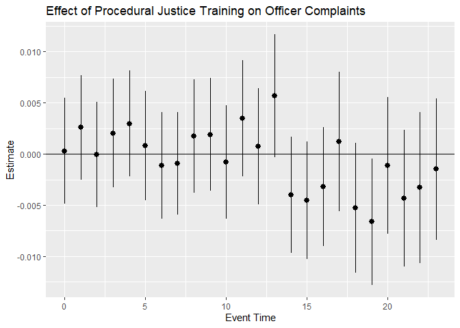

<!-- README.md is generated from README.Rmd. Please edit that file -->

# staggered

<!-- badges: start -->
<!-- badges: end -->

The staggered R package computes the efficient estimator for settings
with randomized treatment timing, based on the theoretical results in
[Roth and Sant’Anna (2023)](https://arxiv.org/pdf/2102.01291.pdf). If
units are randomly (or quasi-randomly) assigned to begin treatment at
different dates, the efficient estimator can potentially offer
substantial gains over methods that only impose parallel trends. The
package also allows for calculating the generalized
difference-in-differences estimators of [Callaway and Sant’Anna
(2021)](https://www.sciencedirect.com/science/article/pii/S0304407620303948)
and [Sun and Abraham
(2021)](https://www.sciencedirect.com/science/article/abs/pii/S030440762030378X)
and the simple-difference-in-means as special cases. There is a Stata
implementation [here](https://github.com/mcaceresb/stata-staggered). (We
also previously wrote a Stata [implementation](#stata-implementation)
via the RCall package, but recommend the native Stata package in the
previous link.)

## Installation

You can install the package from [GitHub](https://github.com/) with:

``` r
# install.packages("devtools")
devtools::install_github("jonathandroth/staggered")
```

## Example

We now illustrate how to use the package by re-creating some of the
results in the application section of [Roth and Sant’Anna
(2021)](https://arxiv.org/pdf/2102.01291.pdf). Our data contains a
balanced panel of police officers in Chicago who were randomly given a
procedural justice training on different dates.

### Loading the package and the data

We first load the staggered package as well as some auxiliary packages
for modifying and plotting the results.

``` r
library(staggered) #load the staggered package
library(ggplot2)   #load ggplot2 for plotting the results

df <- staggered::pj_officer_level_balanced #load the officer data
```

### Simple aggregate parameters

We now can call the function `calculate_adjusted_estimator_and_se` to
calculate the efficient estimator. With staggered treatment timing,
there are several ways to aggregate treatment effects across cohorts and
time periods. The following block of code calculates the simple,
calendar-weighted, and cohort-weighted average treatment effects (see
Section 2.3 of [Roth and Sant’Anna
(2021)](https://arxiv.org/pdf/2102.01291.pdf) for more about different
aggregation schemes).

``` r
#Calculate efficient estimator for the simple weighted average
staggered(df = df, 
          i = "uid",
          t = "period",
          g = "first_trained",
          y = "complaints", 
          estimand = "simple")
#>       estimate          se   se_neyman
#> 1 -0.001126981 0.002115194 0.002119248
```

``` r
#Calculate efficient estimator for the cohort weighted average
staggered(df = df, 
          i = "uid",
          t = "period",
          g = "first_trained",
          y = "complaints", 
          estimand = "cohort") 
#>       estimate          se   se_neyman
#> 1 -0.001084689 0.002261011 0.002264876
```

``` r
#Calculate efficient estimator for the calendar weighted average
staggered(df = df, 
          i = "uid",
          t = "period",
          g = "first_trained",
          y = "complaints", 
          estimand = "calendar")
#>      estimate         se   se_neyman
#> 1 -0.00187198 0.00255863 0.002561472
```

### Event-study Parameters

We can also calculate an \`\`event-study’’ that computes the
average-treatment effect at each lag since treatment.

``` r
#Calculate event-study coefficients for the first 24 months (month 0 is instantaneous effect)
eventPlotResults <- staggered(df = df,         
                              i = "uid",
                              t = "period",
                              g = "first_trained",
                              y = "complaints", 
                              estimand = "eventstudy", 
                              eventTime = 0:23)
  
head(eventPlotResults)
#>        estimate          se   se_neyman eventTime
#> 1  3.083575e-04 0.002645327 0.002650957         0
#> 2  2.591678e-03 0.002614563 0.002621513         1
#> 3 -4.872562e-05 0.002622640 0.002623634         2
#> 4  2.043434e-03 0.002715695 0.002720467         3
#> 5  2.977076e-03 0.002653917 0.002659630         4
#> 6  7.979656e-04 0.002721784 0.002727140         5
```

``` r
#Create event-study plot from the results of the event-study
eventPlotResults$ymin_ptwise <- with(eventPlotResults, estimate + 1.96 * se)
eventPlotResults$ymax_ptwise <- with(eventPlotResults, estimate - 1.96 * se)
ggplot(eventPlotResults, aes(x=eventTime, y =estimate)) +
  geom_pointrange(aes(ymin = ymin_ptwise, ymax = ymax_ptwise))+ 
  geom_hline(yintercept =0) +
  xlab("Event Time") + ylab("Estimate") +
  ggtitle("Effect of Procedural Justice Training on Officer Complaints")
```



### Permutation tests

The staggered package also allows you to calculate p-values using
permutation tests, also known as Fisher Randomization Tests. These tests
are based on a studentized statistic, and thus are finite-sample exact
for the null of no treatment effects *and* asymptotically correct for
the null of no average treatment effects.

``` r
#Calculate efficient estimator for the simple weighted average
#Use Fisher permutation test with 500 permutation draws
staggered(df = df, 
          i = "uid",
          t = "period",
          g = "first_trained",
          y = "complaints", 
          estimand = "simple",
          compute_fisher = T, 
          num_fisher_permutations = 500)
#>       estimate          se   se_neyman fisher_pval fisher_pval_se_neyman
#> 1 -0.001126981 0.002115194 0.002119248       0.642                 0.644
#>   num_fisher_permutations
#> 1                     500
```

### Other Estimators

Our package also allows for the calculation of several other estimators
proposed in the literature. For convenience we provide special functions
for implementing the estimators proposed by Callaway & Sant’Anna and Sun
& Abraham. The syntax is nearly identical to that for the efficient
estimator:

``` r
#Calculate Callaway and Sant'Anna estimator for the simple weighted average
staggered_cs(df = df, 
             i = "uid",
             t = "period",
             g = "first_trained",
             y = "complaints", 
             estimand = "simple")
#>       estimate          se   se_neyman
#> 1 -0.005176818 0.003928735 0.003930919
```

``` r
#Calculate Sun and Abraham estimator for the simple weighted average
staggered_sa(df = df, 
             i = "uid",
             t = "period",
             g = "first_trained",
             y = "complaints", 
             estimand = "simple")
#>     estimate         se  se_neyman
#> 1 0.01153851 0.01730161 0.01730234
```

The Callaway and Sant’Anna estimator corresponds with calling the
staggered function with beta=1 (and the default `use_DiD_A0=1`), and the
Sun and Abraham estimator corresponds with calling staggered with
`beta=1` and `use_last_treated_only=T`. If one is interested in the
simple difference-in-means, one can call the staggered function with
option `beta=0`.

Note that the standard errors returned in the se column are based on the
design-based approach in Roth & Sant’Anna, and thus will differ somewhat
from those returned by the did package. The standard errors in
`se_neyman` should be very similar to those returned by the did package,
although not identical in finite samples.
